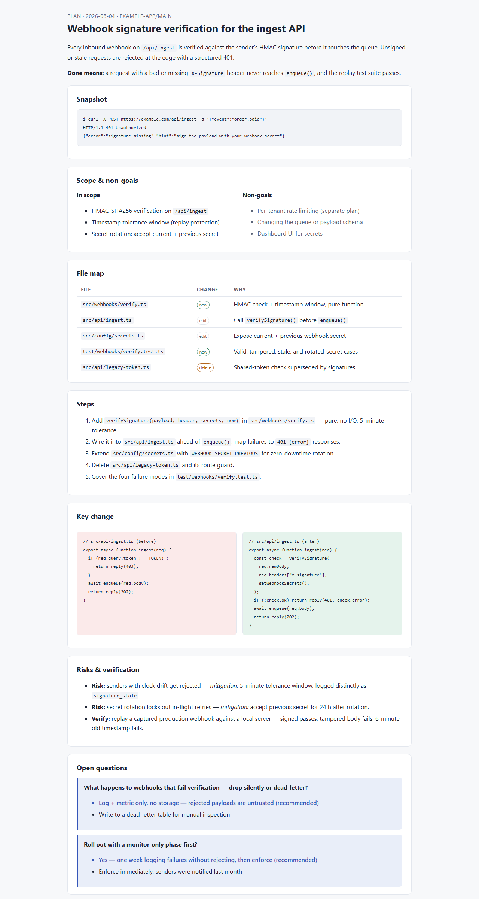

# plan-board

<picture>
  <source media="(prefers-color-scheme: dark)" srcset="../../assets/plan-board-dark.png">
  
</picture>

Render an implementation plan — or any proposal: a design system, a migration, a refactor — as a **single self-contained HTML board** the user reviews and approves before any code is written. One file, inlined CSS, light + dark via `prefers-color-scheme`, zero external requests. The board *is* the approval gate: it ends the planning phase, and the user's answers to its Open Questions fold back into the file until it becomes the record of what was agreed.

Concept ported from [BuilderIO/skills `visual-plan`](https://github.com/BuilderIO/skills/tree/main/skills/visual-plan) (MIT), rebuilt dependency-free — no hosted app, no MCP, no npm install. Just a template and a block vocabulary.

## Use

Trigger with **"visual plan"**, **"plan board"**, **"render the plan"**, **"make this plan reviewable"** — or whenever a plan is substantial enough that burying it in chat would waste it. The board lands in `.apsolut/03-plan/` when that vault exists, else `docs/plans/`, else the session scratchpad.

The one rule: **the board must stand alone.** A reviewer opening the file cold — no chat history — must understand what is being built, why, what it touches, and what is still undecided.

## Files

| File | Purpose |
|------|---------|
| [`SKILL.md`](SKILL.md) | Process: research → gate → compose → build → deliver & hold → fold feedback in |
| [`reference.md`](reference.md) | Block vocabulary, document-quality rules, HTML constraints, pre-handoff checklist |
| [`board-template.html`](board-template.html) | Starter single-file board: token block with dark mode, one skeleton per block type |

## Install

Copy this folder into your skills directory (`~/.claude/skills/plan-board/` for Claude Code) — see the [repo README](../../README.md#install) for all targets.
